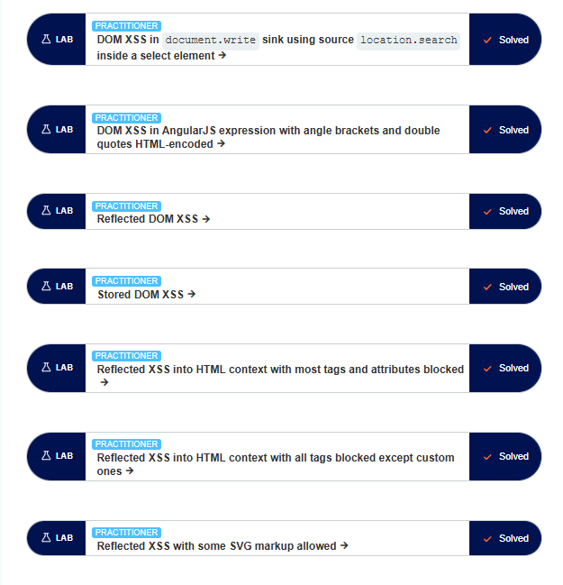
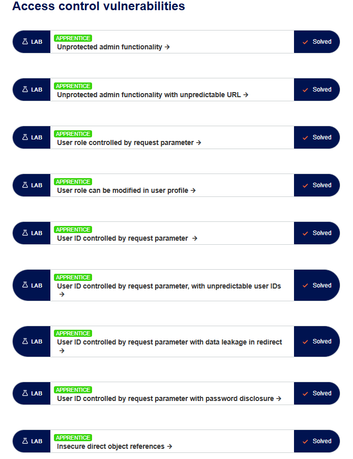

# 🛡️ PortSwigger Academy - Offensive Security Lab Journey 🚀 🔐

Welcome to my advanced security research repository! 👨‍💻 This project documents my hands-on experience and technical mastery in exploiting Web Security vulnerabilities through **PortSwigger Academy** 🎓.

---

## 🏗️ Vulnerabilities Explored & Mastered:

### 1️⃣ SQL Injection (SQLi) 💉 🧬 💾
> Exploiting the database layer to bypass security and exfiltrate sensitive data.

* **🛠️ Techniques & Skills:**
    * 🔑 **Authentication Bypass:** Gaining unauthorized access 🔓.
    * 🧪 **UNION-based Attacks:** Retrieving data from multiple tables 📊.
    * 🕵️‍♂️ **Blind SQLi:** Leveraging conditional responses and time delays ⏳.
    * 💾 **Database Discovery:** Fingerprinting Oracle, MySQL, and MSSQL 🖥️.

#### 📸 Evidence:

---

### 2️⃣ Cross-Site Scripting (XSS) 🧪
Focused on executing malicious scripts in the victim's browser. This section covers Reflected, Stored, and DOM-based XSS attacks.

* **Skills Covered:**
    * ⚡ **Reflected XSS:** Bypassing simple filters and executing `alert()`.
    * 💾 **Stored XSS:** Injecting persistent scripts into web applications.
    * 🌀 **DOM-based XSS:** Exploiting vulnerabilities in client-side JavaScript.
    * 🛡️ **WAF Bypass:** Using encoding and obfuscation to bypass security filters.

#### 📸 XSS Lab Progress & Evidence:
**General XSS Mastery:**

**Beginner to Intermediate Challenges:**

---

### 3️⃣ Path Traversal (Directory Traversal) 📂 🔓 📁
> Bypassing file system restrictions to access unauthorized server files.

* **🛠️ Techniques & Skills:**
    * 📂 **File Access:** Reading `/etc/passwd` and internal config files 📄.
    * 🛡️ **Filter Bypassing:** Evading absolute path blocks 🚧.
    * 🛠️ **Advanced Payloads:** Using Null Byte `%00` and URL encoding 🔗.
    * ✅ **Validation Bypass:** Overcoming "Start of Path" restrictions 🛑.

#### 📸 Evidence:

---

### 4️⃣ Access Control Vulnerabilities 🔑 🚪 🏗️
> Exploiting broken authorization logic to gain unauthorized access to administrative functions.

* **🛠️ Techniques & Skills:**
    * 🚪 **Unprotected Admin Panels:** Discovering hidden administrative interfaces 🔐.
    * 👤 **IDOR (Insecure Direct Object References):** Manipulating user parameters 🆔.
    * 🛠️ **Parameter Tampering:** Escalating privileges from User to Admin 📈.
    * 🔓 **Bypassing Redirects:** Extracting data from sensitive redirects ↪️.

#### 📸 Evidence:

---

## 🛠️ Cyber Toolset & Environment:
| Tool | Purpose | Status | Icons |
| :--- | :--- | :---: | :---: |
| **Burp Suite Pro** | Intercepting & Modifying Traffic | ✅ | 🛸 🛰️ |
| **FoxyProxy** | Quick Proxy Management | ✅ | 🦊 🌐 |
| **Browser DevTools** | DOM & Network Analysis | ✅ | 🛠️ 🔍 |
| **Linux (Kali)** | Security Testing Environment | ✅ | 🐧 💀 |

---

## 📊 Progress Summary:
* 🎯 **Total Labs Solved:** 30+ Labs
* 🔥 **Current Focus:** Advanced Web Exploitation
* 📈 **GitHub Activity:** 45+ Commits Today

---

  <strong>"The more you sweat in training, the less you bleed in battle."</strong> 🛡️🔥🚀

