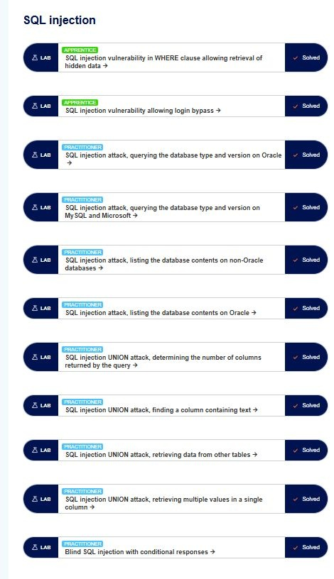

# 🛡️ PortSwigger Academy - Labs Journey

Welcome to my security research repository! This project documents my hands-on experience with Web Security vulnerabilities through **PortSwigger Academy**. 

## 🚀 SQL Injection Mastery
I have successfully exploited various **SQLi** scenarios, ranging from basic data retrieval to advanced **Blind SQL Injection** with conditional responses.

### 🛠️ Vulnerabilities Covered:
* **Authentication Bypass** via SQLi.
* **Data Exfiltration** using UNION-based attacks.
* **Database Version Discovery** (Oracle, MySQL, Microsoft).
* **Blind SQL Injection** (Conditional Responses & Time Delays).

### 📊 Lab Progress & Evidence
Below is a snapshot of the completed labs in the SQL Injection module:

---
*Next Goal: Mastering Cross-Site Scripting (XSS) and Broken Authentication.*
